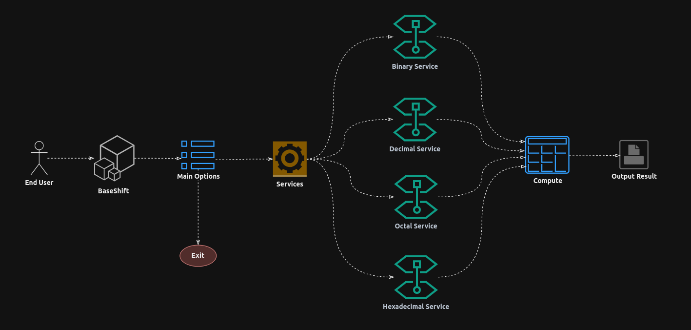

### Description
#


<br />

> - A CLI tool for converting number systems.

> - This will support binary, decimal, octal, and hexadecimal systems.

> - Snap : https://snapcraft.io/baseshift

<br />
<br />


### System Design
#

<br />



<br />
<br />


### Local Development
#
> - Note: `The root main.go is a symbolic link`.

> - Build and run the app.

```bash
# Change permission for the build script.
sudo chmod +x run.sh

# Run the app.
./run
```

> - Below are the installation commands.

```bash
# If app is already installed.
sudo snap refresh baseshift

# If app is not yet installed.
sudo snap install baseshift

# Remove the app using snap.
sudo snap remove baseshift

# Running the app.
baseshift
```
